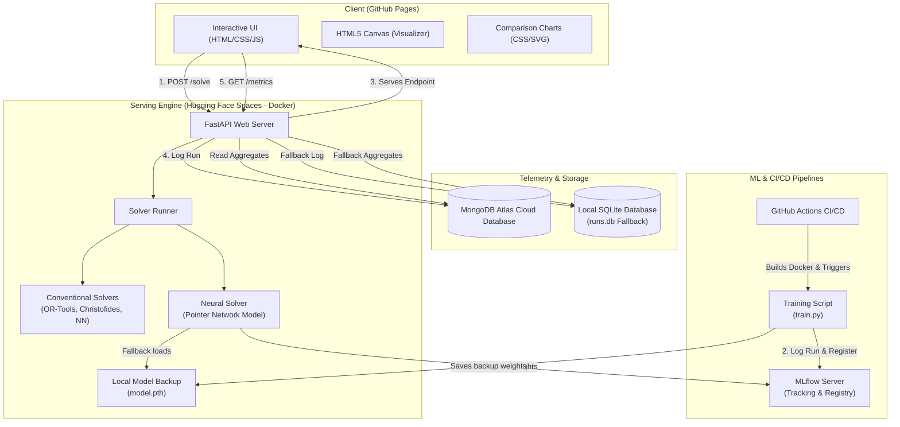
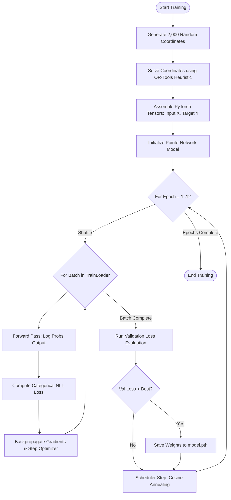

# MLOps Platform Architecture: Neural vs. Conventional TSP Solver

Welcome to the architectural specification for the Traveling Salesman Problem (TSP) solver platform. This document explains **what MLOps is** in plain terms, tells the **story of how MLOps is implemented in this project**, and provides visual **block diagrams** to map out the system.

---

## 1. What is MLOps?

**MLOps** (Machine Learning Operations) is the fusion of **Machine Learning**, **DevOps** (Software Development Operations), and **Data Engineering**. 

In traditional software development, code is compiled and shipped. In Machine Learning, shipping is much harder because the product is a combination of **Code + Model + Data**. Models behave like living, breathing software: their performance can degrade over time as real-world data shifts (data drift), and training models requires significant, complex compute pipelines.

MLOps is the set of practices, pipelines, and cultures designed to automate and standardize the entire lifecycle of an ML model. It bridges the gap between research (training models in notebooks) and production (serving models to users at scale) by ensuring that:
1. **Model training is repeatable and automated**.
2. **Deployments are seamless** and triggered automatically by code changes (CI/CD).
3. **Model performance is continuously monitored** in production (telemetry).

---

## 2. The Story of our MLOps Implementation

This project compares **Conventional Algorithmic Solvers** (which use hard-coded mathematics to find routes) against a **Neural Solver** (a custom PyTorch Pointer Network that learns how to route). 

To make this a true MLOps platform, we implemented a closed-loop system where data generation, model training, containerized serving, deployment, and monitoring are automated. Here is the story of how it works, step-by-step:

### Step 1: The Oracle (The Data Pipeline)
To train a machine learning model, you need labeled training data. For TSP, this means we need sets of city coordinates paired with their optimal visit order. 
* *The MLOps Approach*: Instead of manual labeling, we build a synthetic data pipeline. We generate random 2D coordinate points in `scripts/train.py`, and we use our industry-standard conventional solver (**Google OR-Tools**) to solve them. OR-Tools acts as our **Oracle labeler**, instantly generating near-optimal paths that serve as training targets.

### Step 2: The Student (The Training & Tracking Pipeline)
Once the data is generated, we feed it to our **Pointer Network model** (a Seq2Seq Transformer architecture written in PyTorch). 
* *The MLOps Approach*: The training script `scripts/train.py` automatically logs hyperparameters (learning rate, batch size, epochs) and metrics (train/val loss) per epoch to the **MLflow Tracking Server**. The optimal weights are saved locally and registered in the **MLflow Model Registry** as `tsp-solver`.

### Step 3: The Shipping Container (Containerization)
How do we package the model and the API so they run identically on any machine or cloud?
* *The MLOps Approach*: We use **Docker**. Our `Dockerfile` installs dependencies using `uv` and automatically runs `python scripts/train.py`. The model is trained during the container build phase, and the local `model.pth` checkpoint is baked in to guarantee offline fallback capabilities.

### Step 4: The Conveyor Belt (CI/CD)
When a developer writes new code or tweaks the model architecture, how does it get to the cloud?
* *The MLOps Approach*: We use **GitHub Actions** (`.github/workflows/deploy.yml`). When code is pushed to the `main` branch, the workflow checks out the repository and pushes it directly to Hugging Face Spaces. Hugging Face then triggers a Docker rebuild, automatically retraining the model, registering the version in MLflow, and launching the new API.

### Step 5: The Flight Recorder (Telemetry & Database Fallbacks)
Once the model is running in production, how do we know if it is actually accurate and fast?
* *The MLOps Approach*: We implement **closed-loop telemetry**. Every time a user places cities and hits "Solve" in the UI, the FastAPI backend computes the paths, measures execution latency, and calculates the **Accuracy Gap** (how much longer the neural route is compared to the shortest conventional route). 
* The backend logs this telemetry to **MongoDB Atlas**. If the database is offline or unconfigured, the API automatically falls back to logging runs in a local **SQLite database** (`app/runs.db`). The frontend UI queries these metrics to display live charts of historical performance, closing the MLOps feedback loop.

---

## 3. Visualizing the Architecture (Block Diagrams)

### High-Level System Architecture
This diagram displays the interaction between the visualizer client, the FastAPI backend engine, and the telemetry storage systems.



---

### Model Training Pipeline Flowchart
This flowchart shows how raw coordinates are converted into trained model parameters during compilation.



---

### API Serving & Telemetry Sequence
This sequence diagram shows the runtime execution flow when a user clicks the "Solve" button in the frontend.

```mermaid
sequenceDiagram
    autonumber
    actor User as User Interface (Client)
    participant API as FastAPI Backend
    participant Conv as Conventional Solvers
    participant Neur as Neural Solver (PyTorch)
    database SQLite as Local SQLite (Fallback)
    database Mongo as MongoDB Atlas (Cloud)

    User->>API: POST /solve (Coordinates, Solver List)
    activate API
    rect rgb(20, 25, 40)
        note over API: Loop over selected solvers
        alt Nearest Neighbor / OR-Tools / Christofides / Exact
            API->>Conv: Run solver(coordinates)
            activate Conv
            Conv-->>API: Tour Path, Distance, Latency
            deactivate Conv
        else Neural Solver
            API->>Neur: Run solve_neural(coordinates)
            activate Neur
            note over Neur: Normalizes to [0,1]
            note over Neur: PointerNetwork model(x)
            Neur-->>API: Tour Path, Distance, Latency
            deactivate Neur
        end
    end
    
    rect rgb(25, 30, 45)
        alt MongoDB URI Available
            API->>Mongo: Insert solving run metadata & benchmarking data
            Mongo-->>API: Log confirmation
        else MongoDB Offline / Not Set
            API->>SQLite: Insert run & solver metrics
            SQLite-->>API: Log confirmation
        end
    end
    
    API-->>User: Returns JSON (Solver Results & Log Status)
    deactivate API
```
